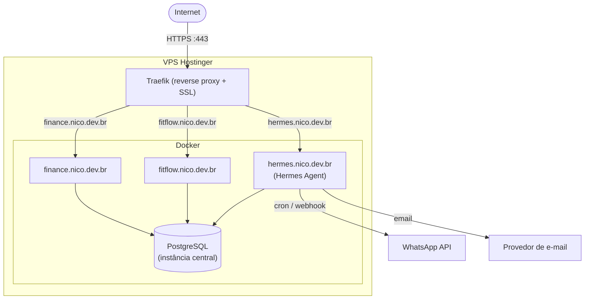

# Arquitetura de Infra em Mermaid

Diagrama de onde as coisas rodam fisicamente/logicamente: VPS, containers Docker, rede, reverse proxy, domínios. Extremamente útil pro setup do Beto (Hostinger VPS + Docker + Traefik + Postgres centralizado + múltiplos projetos em subdomínios de `nico.dev.br`).

## Exemplo — VPS com Traefik + múltiplos projetos + Postgres central

## Elementos que aparecem com frequência nesse tipo de diagrama

- **Entrada externa**: `Internet`, usuários, DNS (`nico.dev.br` e subdomínios).
- **Reverse proxy** (Traefik/Nginx): sempre a primeira caixa depois da internet, roteando por domínio/subdomínio.
- **Containers Docker**: um nó por serviço/container, agrupados num subgraph `Docker` dentro do subgraph da VPS.
- **Storage compartilhado**: Postgres central, volumes, S3-compatible storage (ex: Garage) — geralmente desenhado como cilindro `[( )]` e recebendo setas de múltiplos containers.
- **Serviços externos**: APIs de terceiros (WhatsApp, email, OAuth providers) — fora do subgraph da VPS.
- **Rede interna vs. exposta**: se for relevante, diferencie com subgraphs aninhados (ex: uma rede Docker interna que não é exposta publicamente).

## Boas práticas

- Nomeie os containers com o domínio real (`hermes.nico.dev.br`) quando o projeto já estiver em produção — isso faz o diagrama servir de documentação de verdade, não só ilustração genérica.
- Se a infra tiver CI/CD (GitHub Actions fazendo deploy), pode valer um segundo diagrama (sequence ou flowchart `LR`) só pro pipeline de deploy, em vez de lotar o diagrama de infra estática com isso.
- Quando o projeto crescer (múltiplos VPS, load balancer, staging vs. produção), separe em diagramas por ambiente em vez de um só tentando mostrar tudo.
