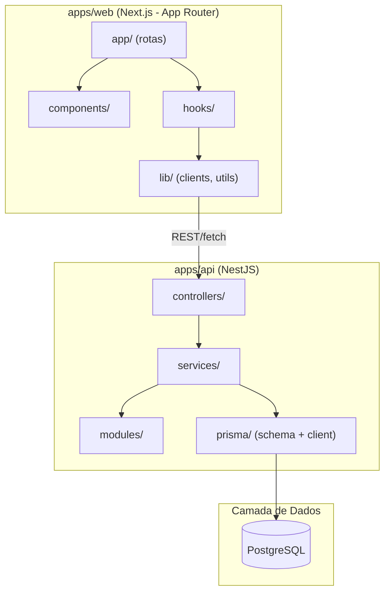

# Arquitetura de Projeto (código) em Mermaid

Diagrama que mostra como o CÓDIGO do projeto está organizado — camadas, módulos, pastas, dependências. Diferente do C4 Container (que é sobre sistemas/serviços) e diferente da arquitetura de infra (sobre onde as coisas rodam).

Use `flowchart` com subgraphs representando camadas/pastas.

## Exemplo — projeto Next.js + NestJS (stack típico do Beto)

## Variações comuns

- **Monorepo**: use subgraphs de nível superior por `apps/` e `packages/`, mostrando quais pacotes compartilhados (`packages/ui`, `packages/config`) cada app consome.
- **Arquitetura em camadas (layered/clean architecture)**: subgraphs de cima pra baixo — `Presentation` → `Application/Use Cases` → `Domain` → `Infrastructure` — com setas indicando que camadas superiores dependem de inferiores, nunca o contrário (se aparecer seta de baixo pra cima, é sinal de acoplamento invertido — vale comentar isso quando notar).
- **Feature-based** (organização por funcionalidade em vez de por tipo de arquivo): subgraph por feature (`features/auth`, `features/workouts`), cada um com seus próprios componentes/hooks/services internos.

## Boas práticas

- Espelhe a estrutura real de pastas do projeto — se o usuário já tem `src/modules/auth`, o subgraph deve se chamar exatamente isso, não uma versão genérica.
- Não desenhe todo arquivo — agregue por pasta/módulo. Granularidade de arquivo individual só quando o usuário pedir explicitamente pra detalhar um módulo específico.
- Diferencie visualmente dependência direta (seta sólida `-->`) de dependência opcional/eventual (seta tracejada `-.->`, ex: um módulo que só é chamado condicionalmente).
