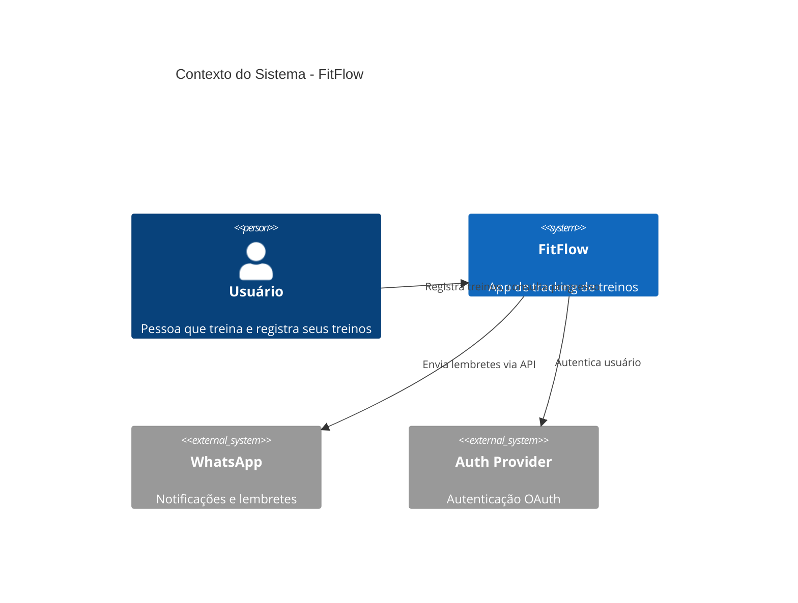
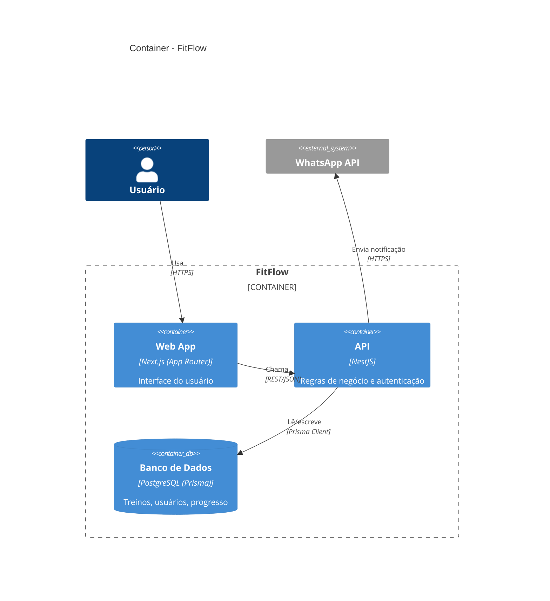
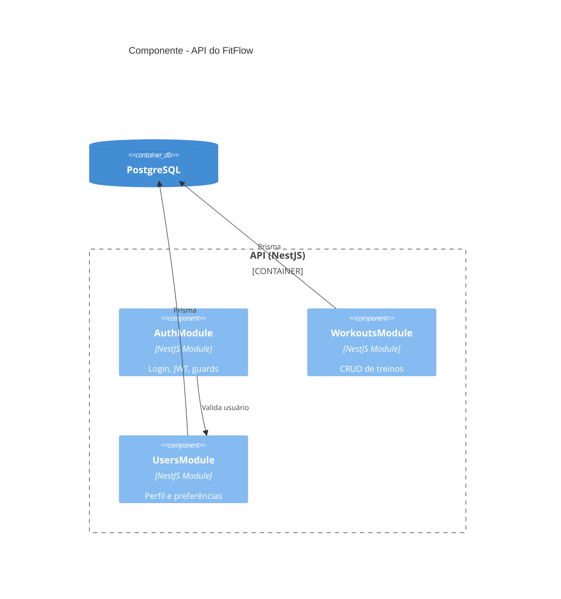

# C4 Model em Mermaid

O C4 model tem 4 níveis: Contexto → Container → Componente → Código. Na prática, foque nos 3 primeiros — o nível "Código" raramente vale a pena manter como diagrama (o próprio código já é a fonte da verdade).

Mermaid suporta C4 nativamente via `C4Context`, `C4Container`, `C4Component`.

## Nível 1 — Contexto (visão macro: quem usa o sistema, com o que ele conversa)

## Nível 2 — Container (as "caixas" internas: frontend, backend, banco, filas)

## Nível 3 — Componente (dentro de UM container específico, ex: dentro da API)

## Boas práticas específicas de C4

- **Comece sempre pelo Contexto**, mesmo que o usuário só peça "container" — ajuda a confirmar que você entendeu os limites do sistema antes de detalhar.
- Use `System_Ext` para tudo que é externo (WhatsApp, provedores OAuth, APIs de terceiros) — isso deixa claro visualmente o que é responsabilidade do projeto e o que não é.
- `ContainerDb` é o tipo certo para bancos de dados (renderiza com ícone de cilindro).
- Para o stack típico do Beto (Next.js + NestJS + Prisma + Postgres), o padrão de Container costuma ser: `Web App (Next.js)` → `API (NestJS)` → `ContainerDb (PostgreSQL via Prisma)`, mais containers extras conforme o projeto (ex: Redis, filas, workers).
- Se o sistema já estiver em produção na VPS (Traefik/Docker), o diagrama de Contexto/Container é sobre a **arquitetura lógica** — a arquitetura física de infra (onde cada coisa roda, quais containers Docker) é um diagrama separado, ver `architecture-infra.md`. Não misture os dois no mesmo diagrama.
