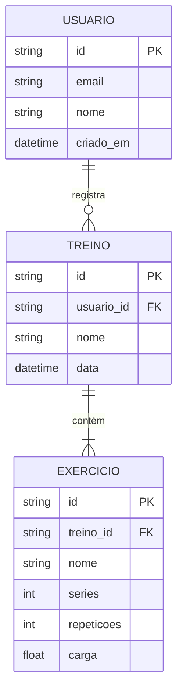

# ERD (Modelagem de Banco de Dados) em Mermaid

Usa `erDiagram`. Ótimo pra gerar direto a partir de um `schema.prisma` existente (ver `retroactive.md` pra extração automática).

## Sintaxe básica

## Notação de cardinalidade (lado esquerdo | lado direito da relação)

| Símbolo | Significado |
|---|---|
| `\|o` | zero ou um |
| `\|\|` | exatamente um |
| `}o` | zero ou muitos |
| `}\|` | um ou muitos |

Exemplos comuns:
- `USUARIO \|\|--o{ TREINO` → um usuário tem zero ou muitos treinos (1:N opcional)
- `TREINO \|\|--\|{ EXERCICIO` → um treino tem um ou muitos exercícios (1:N obrigatório)
- `TAG }o--o{ TREINO` → muitos-para-muitos (tabela de junção implícita)

## Convertendo de Prisma schema para ERD

Ao ler um `schema.prisma`:
1. Cada `model` vira uma entidade (nome em CAIXA no Mermaid, mas pode manter o nome original do model como label).
2. Campos com `@id` → marque como `PK`.
3. Campos que são `@relation` com uma FK explícita → marque como `FK` na entidade que a possui.
4. Relações `@relation` de um-para-muitos (`Model[]` num lado, `Model` no outro) → `||--o{`.
5. Relações muitos-para-muitos (Prisma implícito, sem tabela explícita, ou tabela explícita de junção) → `}o--o{`.
6. Não precisa listar TODOS os campos do schema no diagrama — priorize campos que ajudam a entender a modelagem (PKs, FKs, campos únicos, campos de negócio importantes). Campos de metadata pura (`createdAt`, `updatedAt`) podem ser omitidos ou agrupados se o diagrama ficar muito poluído.

## Boas práticas

- Para bancos grandes (15+ tabelas), considere dividir por domínio (ex: um ERD só de "autenticação/usuários", outro de "treinos/exercícios") em vez de um ERD monolítico.
- Nomeie o relacionamento (o texto depois do `:`) com um verbo que descreva a relação de negócio ("registra", "contém", "pertence a") — ajuda muito mais que deixar sem label.
- Se o projeto usa enums do Prisma, pode representá-los como comentário no diagrama ou como uma entidade separada só se for relevante para o entendimento (geralmente não vale a pena virar entidade própria).
