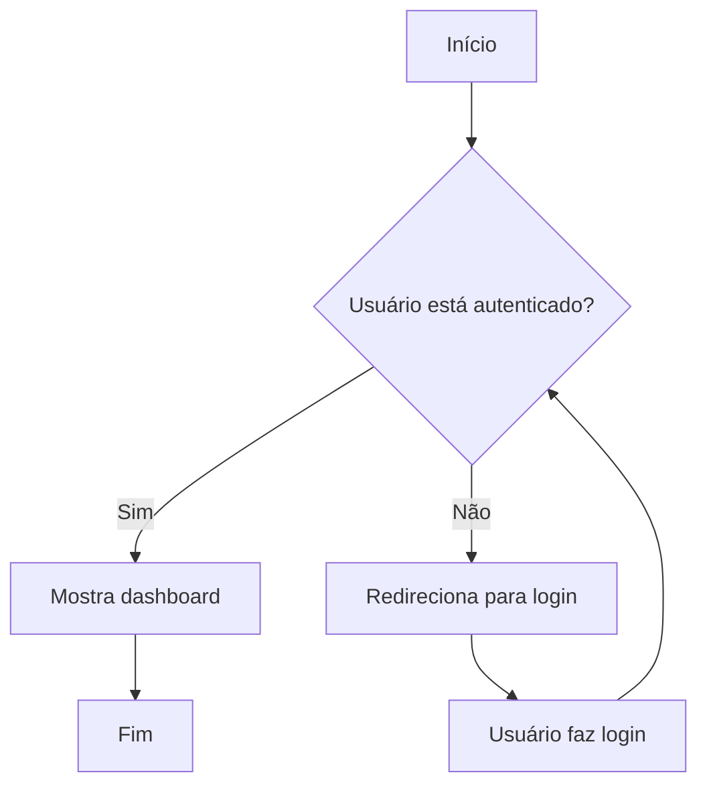
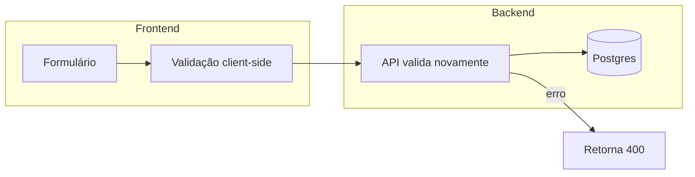

# Flowcharts em Mermaid

Para fluxos de decisão, processos de negócio, jornadas de usuário, lógica de algoritmo.

## Sintaxe básica

## Formas de nó e quando usar

| Sintaxe | Forma | Uso |
|---|---|---|
| `A[Texto]` | Retângulo | Ação/processo padrão |
| `A(Texto)` | Retângulo arredondado | Início/fim de um sub-fluxo |
| `A([Texto])` | Estádio (pill) | Início/fim do fluxograma inteiro |
| `A{Texto}` | Losango | Decisão (if/else) |
| `A[(Texto)]` | Cilindro | Banco de dados / storage |
| `A[[Texto]]` | Subrotina | Chamada a outro processo/fluxo |
| `A>Texto]` | Bandeira | Evento assíncrono/trigger |

## Direção

- `TD` (top-down) ou `TB`: padrão pra fluxos de decisão, hierarquias, a maioria dos casos.
- `LR` (left-right): melhor pra pipelines lineares (ex: CI/CD, ETL, request→response).

## Estilizando com subgraphs (agrupar etapas relacionadas)

## Boas práticas

- IDs de nó curtos (`A`, `B`, `AuthCheck`) sem espaço; o texto legível vai dentro dos colchetes/labels.
- Labels com caracteres especiais (`:`, `"`, `/`) precisam de aspas: `A["Login: usuário/senha"]`.
- Para jornada de usuário com múltiplos caminhos de erro, sempre feche os ramos (não deixe nó "solto" sem destino final) — ou volta pro fluxo principal, ou termina em um nó de fim.
- Prefira quebrar em vários flowcharts menores (um por fluxo/feature) a um "mega-fluxograma" com 30+ nós — fica ilegível e difícil de manter.
