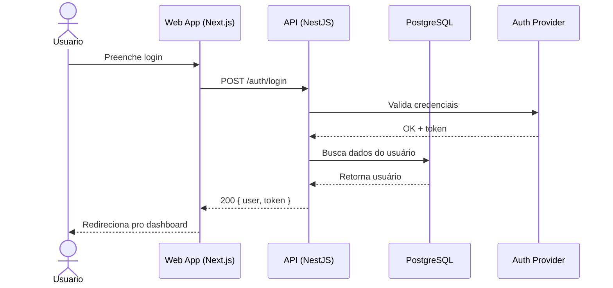
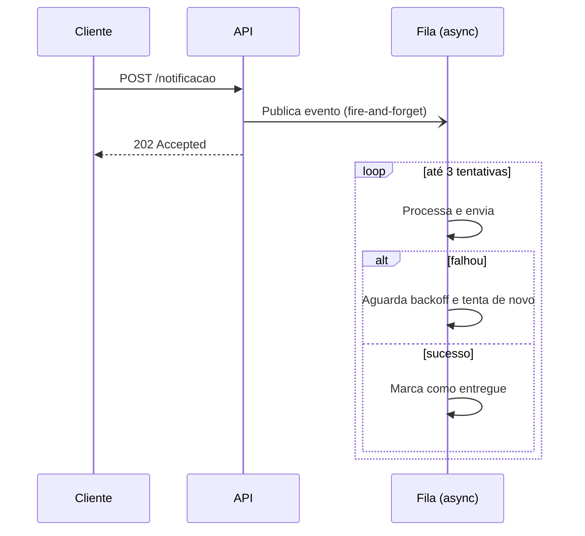

# System Design / Sequence Diagrams em Mermaid

Usa `sequenceDiagram`. Ideal pra mostrar a ORDEM TEMPORAL de chamadas entre componentes — auth flow, request lifecycle, integração entre serviços, retry/timeout logic.

## Sintaxe básica

## Elementos importantes

- `actor` vs `participant`: use `actor` para pessoas (usuário), `participant` para sistemas/serviços.
- `->>`: chamada síncrona (linha sólida, seta cheia).
- `-->>`: resposta (linha tracejada, seta cheia) — sempre use pra respostas, ajuda a diferenciar visualmente request de response.
- `-)`: mensagem assíncrona (fire-and-forget, ex: publicar evento numa fila).
- `alt`/`else`/`end`: fluxo condicional (ex: sucesso vs. erro de autenticação).
- `loop`/`end`: repetição (ex: polling, retry).
- `Note over A,B: texto`: anotação explicativa sobre um trecho do fluxo.

## Exemplo com erro/retry (útil pra documentar resiliência)

## Quando usar sequence diagram vs. flowchart

- **Sequence**: quando a ORDEM e o TEMPO importam (quem chama quem, em que ordem, request/response). Ideal pra auth flows, chamadas entre microserviços, integrações com webhooks/filas.
- **Flowchart**: quando é sobre LÓGICA/DECISÃO, não sobre comunicação entre sistemas ao longo do tempo.

Se o pedido for tipo "como funciona o fluxo de autenticação do sistema" → sequence diagram é quase sempre a escolha certa, porque envolve múltiplos participantes trocando mensagens em ordem.

## Boas práticas

- Limite a 5-6 participantes por diagrama; mais que isso vira ilegível — considere quebrar em diagramas separados por sub-fluxo.
- Sempre nomeie a mensagem com o verbo/método real quando souber (`POST /auth/login`, não só "faz login") — isso vira documentação técnica de verdade.
- Para integrações com MCP servers/agentes (Hermes Agent, orquestração), o padrão costuma ser: `Usuario/Trigger (cron)` → `Agente Orquestrador` → múltiplos `participant` por MCP server chamado (Gmail, Telegram, etc.) — bom caso de uso pra visualizar o harness.
